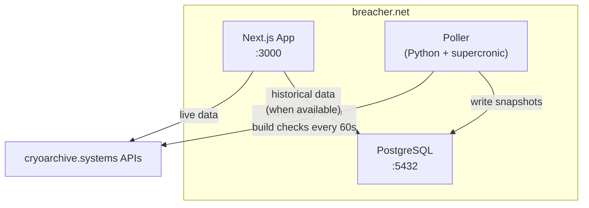

# breacher.net

Community hub and live tracking dashboard for the [Marathon](<https://en.wikipedia.org/wiki/Marathon_(upcoming_video_game)>) ARG — built by the Breachers of Tomorrow.

**Live site:** [breacher.net](https://breacher.net) (coming soon)

## What is this?

The Marathon ARG revolves around [cryoarchive.systems](https://cryoarchive.systems), an in-universe website that updates in real-time with kill counts, sector states, camera stabilization levels, and more. This project tracks those changes, provides historical data, and serves as a community gateway.

### Features

- **Live Dashboard** — Real-time sector status, kill counter with delta tracking, ship date countdown
- **Camera Monitoring** — Stabilization levels for all CCTV cameras with alert thresholds
- **Build Tracker** — Detects and logs changes to cryoarchive.systems
- **Historical Charts** — Kill count and stabilization trends over time (requires database)
- **Community Hub** — Links to Discord, Google Doc, and other community resources

## Quick Start

### Option 1: Full stack with Docker (recommended)

```bash
git clone https://github.com/breachers-of-tomorrow/breacher-net.git
cd breacher-net
docker compose up
```

This starts:
- **App** — Next.js on [http://localhost:3000](http://localhost:3000)
- **Database** — PostgreSQL for historical data
- **Poller** — Automatically collects state snapshots every 5 minutes + build checks every 60 seconds

### Option 2: App only (no database)

```bash
git clone https://github.com/breachers-of-tomorrow/breacher-net.git
cd breacher-net
npm install
npm run dev
```

The app works without a database — it fetches directly from the cryoarchive.systems API. Historical charts won't be available, but all live data features work.

## Architecture



- **Next.js App** — Server-rendered React with App Router. Fetches live data from cryoarchive.systems, serves historical data from PostgreSQL when available.
- **Poller** — Python service on a cron schedule. Snapshots state every 5 min, checks for build changes every 60s.
- **PostgreSQL** — Stores historical snapshots for charts and the build change log.

## Tech Stack

| Component | Technology |
|-----------|-----------|
| Frontend | Next.js 16, React 19, TypeScript 5 |
| Styling | Tailwind CSS 4 |
| Database | PostgreSQL 16 |
| Poller | Python 3.12, supercronic |
| CI/CD | GitHub Actions → ghcr.io |
| Hosting | Kubernetes (self-hosted) |

## Project Structure

```
src/
├── app/                    # Next.js App Router pages
│   ├── api/                # API routes (health, history, builds)
│   ├── cryoarchive/        # ARG tracking pages
│   │   ├── cameras/        # Camera stabilization monitoring
│   │   ├── changes/        # Build change tracker
│   │   └── maps/           # Terminal maps
│   └── page.tsx            # Landing page
├── components/             # Shared React components
└── lib/                    # Utilities (API client, DB, types, formatting)
poller/                     # Python poller service
db/                         # Database schema
```

## Contributing

See [CONTRIBUTING.md](CONTRIBUTING.md) for development workflow, branch strategy, and guidelines.

**TL;DR:** Fork → feature branch → PR to `develop`. Run `npm run lint && npm run build` before pushing.

## Related Resources

- **[Winnower Garden Cryoarchive](https://marathon.winnower.garden/cryoarchive)** — Comprehensive historical data going back to the start of the ARG. If you need data from before this project existed, Winnower has it.
- **[cryoarchive.systems](https://cryoarchive.systems)** — The official in-universe site this project tracks.

## Credits

Originally created by [CrowdTypical](https://github.com/CrowdTypical) as [Marathon-arg](https://github.com/CrowdTypical/Marathon-arg). Forked and evolved by [Breachers of Tomorrow](https://github.com/breachers-of-tomorrow).

Historical ARG data preserved by [Winnower Garden](https://marathon.winnower.garden/cryoarchive).

## License

MIT
